# Moncla Lab Illumina Pipeline Documentation

This document covers a more comprehensive overview of this pipeline.
## Table of Contents

1. [**Starting from reads**](#1-≈) - Obtaining raw read data and associated metadata
2. [**Configuration**](#2-configuration) - How to configure the pipeline.
3. [**Tools utilized**](#3-tools-utilized) - Bioinformatics tools used in this pipeline with a brief description and rationale.
4. [**User stories**](#4-user-stories) - Various use cases for this pipeline and how to execute them, with examples.
5. [**Output produced**](#5-output-produced) - The various files that are produced by this pipeline.

## Introduction

This pipeline aspires to be of great utility for nearly all Illumina PCR experiments performed by the Moncla lab, by doing the following things in a scientifically accurate manner:

- **Easily install and configure** for various usages
- **Easily pull data** out of BaseSpace or SRA and organize it for ingestion by the pipeline
- For **each sequencing experiment**, yield information for preliminary analyses such as coverage calculations
- For each **biological sample**, yield information for downstream analyses such as consensus genomes, annotated variant calls, and translated proteins
- For some **biological samples**, yield information for those that were so thoroughly sequenced such that analyses of **technical replicates** can be performed
- Perform the above analyses via **batch processing**, allowing all jobs to be queued as easily as an individual job

The typical wet lab set up looks something like the following, producing massive amounts of data from which biological information is to be extract:

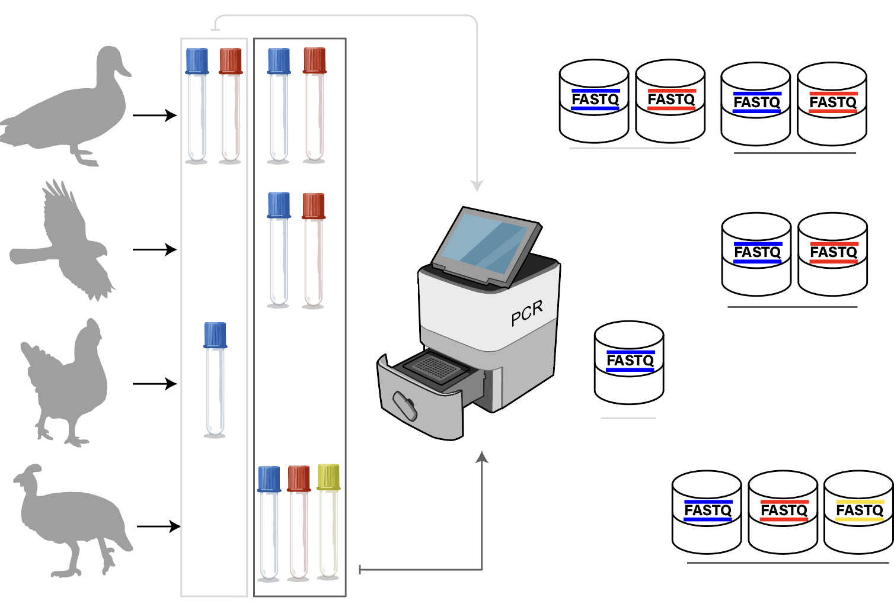

It is useful to establish a common vocabulary. Beginning at the absolute atomic unit, we gather **biological samples** to perform **sequencing experiments**. This generates **datasets**. Note that in the above, there’s often many sequencing experiments performed on an individual sample, but there is always a one-to-one correspondence between a sequencing experiment and the corresponding FASTQ dataset that is generated.

Read data is generated in this lab by Illumina instruments and finds its way into the BaseSpace web application. It needs to be pulled down locally to be analyzed. It comes in an unwieldy format that needs to be tidied up for ingestion by this pipeline. Some context needs to be provided to the pipeline by a technician so that it understands what the various FASTQs represent biologically, which is performed by population of a sequencing metadata spreadsheet. The pipeline takes it from there.

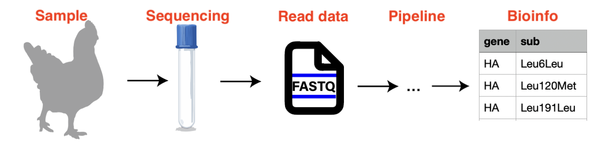

This document describes the process of extracting different kinds of relevant biological information in detail.

## 1. Starting from reads

### Downloading FASTQ datasets

At this stage, we assume the lab technicians have done their part of the process and sequenced a few samples. There's raw read data available in Illumina Basespace waiting to be analyzed. It's now on the informatician to continue the work, and extract some information from this data. Begin by logging into BaseSpace and sure that you're associated to the correct group:


Navigate to projects and select the appropriate one...

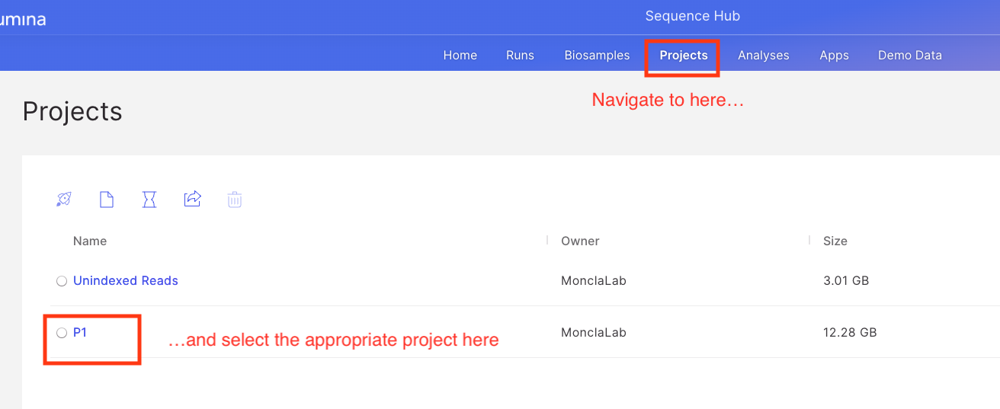

Navigate to FASTQs, and select the IDs that you intend to analyze...

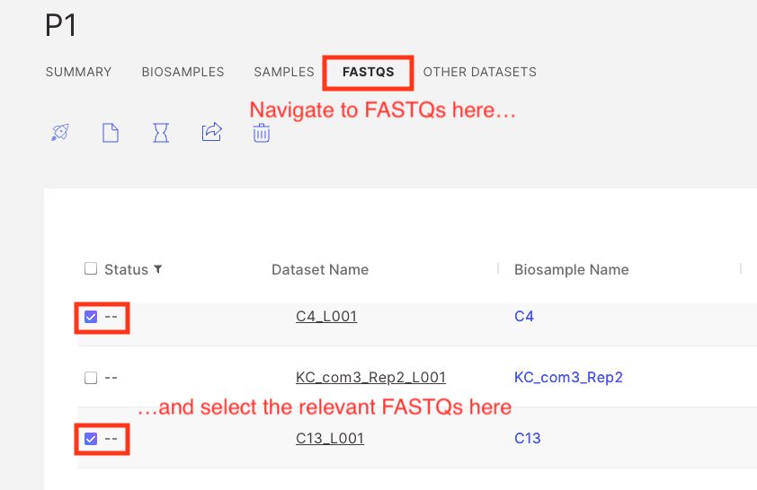

Go back up to the file icon and select dataset from the following dropdown...

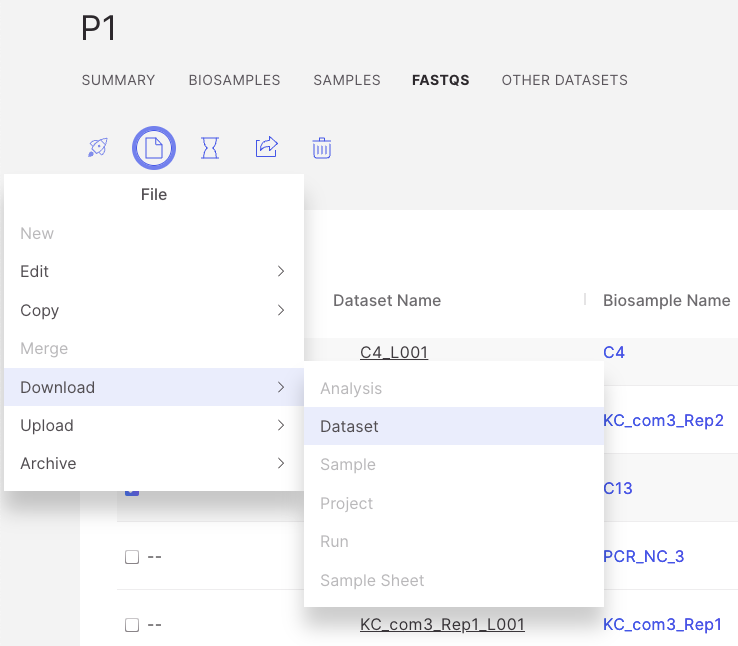

You'll be prompted with the files that you're going to download. You will need Illumina Basespace downloader to be installed on your local machine if you haven't already. Also, one quirk I've found is that this program needs to be open for me. The web application can start a download in the program if it's already open, but if it's not, it doesn't open it for you.

Click download to proceed...

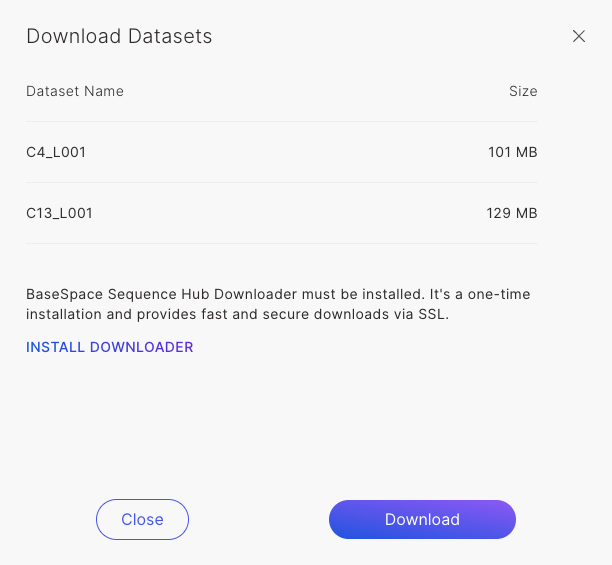

Select the folder where you'd like your sequences locally, then click start download...

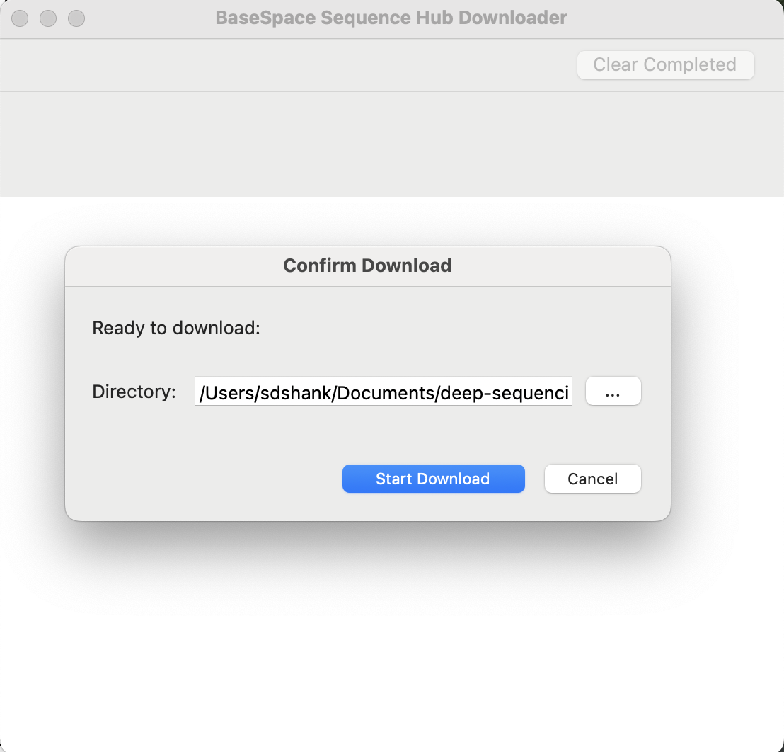

If you've made it this far, and see the download in action as below, congratulations! You have completed the first step of informatics: get the data!

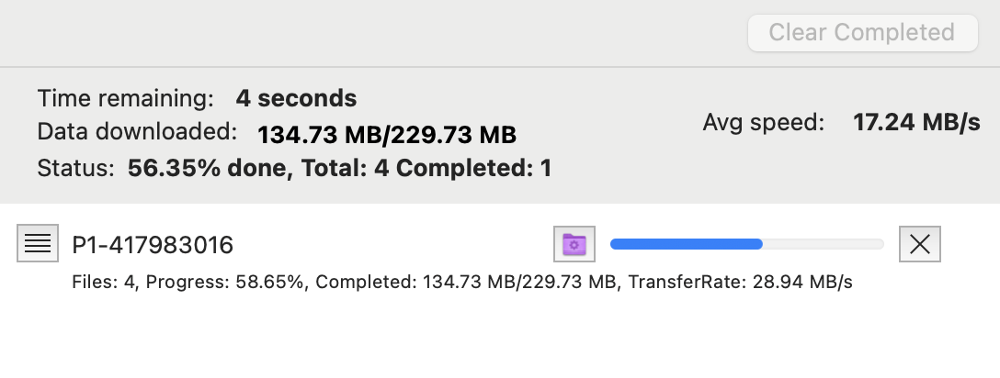

### Downloading metadata

It is also useful to have all the sequencing metadata from the various projects that you'd like to analyze. This is the easiest way to build the newline delimited textfiles of sequencing run IDs that are the very first touchpoint of the pipeline. These can be downloaded in the following manner. 

From Sequence Hub, navigate to runs:


Then select the appropriate project:

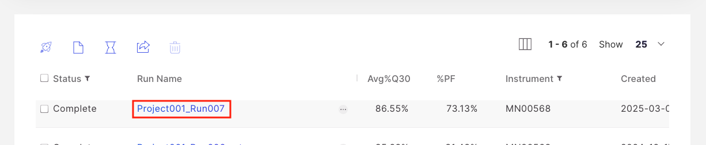

Navigate to files:

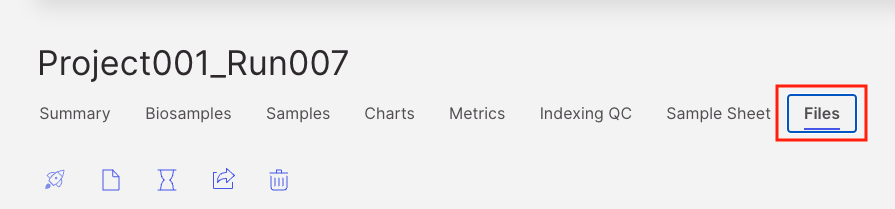

And download the sample sheet:

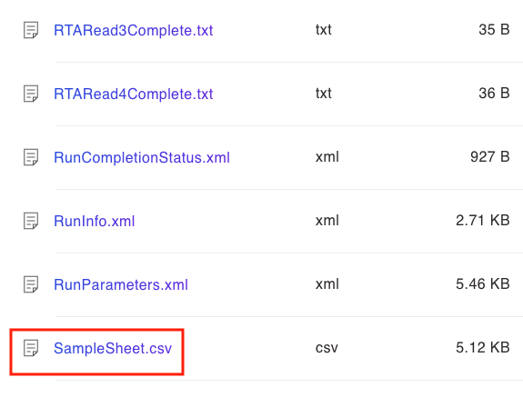

These sheets have the IDs that will be consumed by the pipeline:

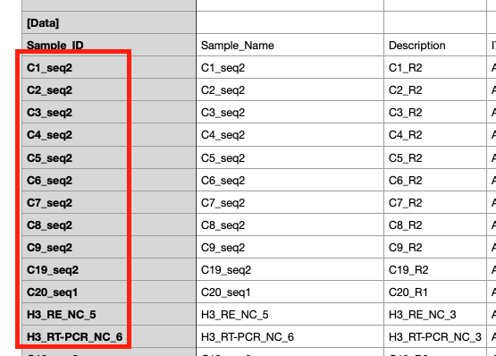

You can now refer back to the [README](https://github.com/moncla-lab/illumina-pipeline/blob/main/README.md) for how to set up and do a first run. Just remember the directory that you used above, as that will need to go into the configuration file for the repository.

## 2. Configuration

We use YAML (a practice recommended by Snakemake) to configure both tools and rules. See `config.yml.template` at the root of the repository, which contains our recommended default parameters. 

### Description of individual configuration parameters

- **`reference`** - Determines what is used as the reference.  Works with multi-segmented viruses like influenza. See `references.tsv` for the exact accessions that are use, as well as the `fetch_reference_data` rule.

- **`data_root_directory`** - Where the data from BaseSpace has been exported to (refer back to [starting from reads](#1-starting-from-reads) if necessary). This pipeline has functionality (in `mlip.dataflow.situate_basespace_data`) to seamlessly move data out of the unwieldy format provided by default into a much cleaner format in this pipeline for ingestion.

-   **`number_of_remappings: 2`**: How many times to re-align reads (e.g., to a refined reference). More remappings can eliminate some computational artifacts in the final processed data, but at the expense of more computational running time.
-   **`use_vapor: false`**: Whether to use the "VAPOR" tool for choosing sample-specific references.
-   **`trimming_minimum_length: 50`**: Discards reads that become shorter than this length (in base pairs) after all trimming steps. This removes uninformative short fragments.
-   **`trimming_window_size: 5`**: Sets the length of the sliding window used to assess average read quality. If average quality in the window drops below minimum_quality_score, the read is trimmed.
-   **`minimum_quality_score: 30`**: For Trimmomatic, it's the average quality threshold for the sliding window trimmer. For VarScan, it's the minimum average base quality supporting a variant call.
-   **`consensus_minimum_coverage: 10`**: (iVar & Samtools) The minimum number of reads required to cover a position to call a base (other than 'N') in the consensus sequence. Ensures calls are based on sufficient data.
-   **`consensus_minimum_frequency: .5`**: The minimum frequency an allele must have to be called in the consensus by iVar. A value like 0.5 aims to call the majority base.
-   **`variants_minimum_coverage: 100`**: The minimum read depth required at a position to attempt variant calling. This ensures variants are called from well-covered regions.
-   **`variants_minimum_frequency: .01`**: The minimum allele frequency a variant must reach to be reported by variant calling. This filters out very low-frequency potential errors
-   **`strand_filter: 1`**: Enable a filter that checks if variants are supported by reads from both DNA strands (helps remove artifacts). Ignore variants with greater than 90% support on only one strand.

## 3. Tools utilized

We use a wide variety of tools. Below goes over each step of the pipeline. This pipeline utilizes [Snakemake](https://snakemake.readthedocs.io/en/stable/), [Bioconda](https://bioconda.github.io/), [BioPython](https://biopython.org/), [Pandas](https://pandas.pydata.org/), [Genbank records](https://www.ncbi.nlm.nih.gov/genbank/samplerecord/), [GTF format](https://genome.ucsc.edu/FAQ/FAQformat.html#format4), [Trimmomatic](https://academic.oup.com/bioinformatics/article/30/15/2114/2390096), [Bowtie2](https://www.nature.com/articles/nmeth.1923), [SAMtools](https://academic.oup.com/bioinformatics/article/25/16/2078/204688), [VarScan](https://genome.cshlp.org/content/22/3/568.short), [BEDTools](https://academic.oup.com/bioinformatics/article/26/6/841/244688), [SeqKit](https://journals.plos.org/plosone/article?id=10.1371/journal.pone.0163962), [MultiQC](https://academic.oup.com/bioinformatics/article/32/19/3047/2196507), [NCBI E-utilities](https://www.ncbi.nlm.nih.gov/books/NBK25501/), and [Bash](https://www.gnu.org/software/bash/). We hope curious users will consult the documentation of the tools and libraries used herein to aid in understanding.

### `fetch_reference_data`

Fetches the reference sequence and metadata for a specific viral genome segment from NCBI.

- **Output**:
  - `sequence.fasta`: FASTA-formatted nucleotide sequence.
  - `metadata.gb`: GenBank-formatted metadata.

- **Parameters**:
  - `genbank_accession`: retrieved from `reference_dictionary` based on the segment name.

- **Resources**:
  - `ncbi_fetches=1`: indicates a single remote fetch operation... your request can get blocked if you make too many requests at once.

- **Commands**:
  - `efetch`: downloads records from NCBI's `nuccore` database.
    - `-db nuccore`: specifies the nucleotide database.
    - `-id`: the GenBank accession ID.
    - `-format genbank|fasta`: output format.
  - `seqkit replace`: standardizes the FASTA header to include the segment name and data source.

Use this rule to seed the pipeline with consistent reference data per segment.

### `build_full_reference`

Concatenates all segment-level FASTA files into a single reference FASTA.

- **Input**:
  - One FASTA file per segment: `data/reference/{segment}/sequence.fasta`

- **Output**:
  - `sequences.fasta`: unified multi-sequence FASTA file for downstream steps.

- **Command**:
  - `cat`: concatenates all segment FASTA files into one.

Use this rule to generate a comprehensive reference file covering all genome segments.

### `genbank_to_gtf`

Converts GenBank metadata into GTF format for a given viral genome segment.

- **Input**:
  - `metadata.gb`: GenBank-formatted annotation file.

- **Output**:
  - `metadata.gtf`: GTF-formatted annotation file for the same segment.

- **Command**:
  - `genbank_to_gtf(...)`: a custom Python function that parses the GenBank file and writes a GTF.

Use this rule to enable downstream tools that require GTF-formatted annotations.

### `full_gtf`

Combines per-segment GTF files into a single annotation file.

- **Input**:
  - One GTF file per segment: `metadata.gtf`

- **Output**:
  - `metadata.gtf`: unified annotation file across all genome segments.

- **Command**:
  - `cat`: concatenates all segment-level GTFs into a single file.

Use this rule to prepare a complete annotation reference for tools requiring genome-wide GTF input.

### `coding_regions`

Extracts coding region coordinates from the full GTF and maps them to segment names using reference FASTA files.

- **Input**:
  - `metadata.gtf`: combined genome annotation in GTF format.
  - `sequence.fasta`: one FASTA file per segment.

- **Output**:
  - `coding_regions.json`: a JSON dictionary mapping each segment to its coding regions.

- **Function**: `extract_coding_regions(...)`
  - `define_coding_regions(input_gtf)`: parses the GTF to extract CDS or gene features.
  - Uses `SeqIO.read(...)` to match GenBank accessions in FASTA files to segment names.
  - Builds a mapping from segment → coding regions and writes it as JSON.

Use this rule to provide structured, programmatic access to coding region annotations by segment.

Apologies for the over-correction! You're right, let's stick to the original brevity and format, just updated for the Python implementation.

### `concatenate_replicates_from_manifest`

Merges all sequencing experiments for a given sample replicate into single forward and reverse FASTQ files.

-   **Input (via `data/file_manifest.json` and wildcards):**
    -   Paths to source `forward.fastq.gz` (or `.fastq`) and `reverse.fastq.gz` (or `.fastq`) files for experiments belonging to the specified sample and replicate.
    -   Information on whether source files are gzipped and if they are low-coverage.

-   **Output:**
    -   Combined `forward.fastq` (uncompressed) per sample replicate.
    -   Combined `reverse.fastq` (uncompressed) per sample replicate.

-   **Process (Python function `concatenate_replicates_from_manifest_py`):**
    -   Reads experiment details from `data/file_manifest.json`.
    -   Excludes experiments marked as low-coverage.
    -   If source files are gzipped, they are decompressed in Python during reading.
    -   Contents are appended sequentially to the output FASTQ files.

Use this rule to unify multiple sequencing runs (excluding low-coverage ones) into a single pair of FASTQ files per replicate for downstream processing.

### `trimmomatic`

Performs quality trimming on paired-end reads for a specific replicate using Trimmomatic.

- **Input**:
  - Raw `forward.fastq.gz` and `reverse.fastq.gz` for the replicate.

- **Output**:
  - `*_paired.fastq`: high-quality paired reads.
  - `*_unpaired.fastq`: reads where the mate was discarded.
  - `concatenated.fastq`: all trimmed reads combined.
  - `trimmomatic-stdout.txt`: Trimmomatic's stdout.
  - `trimmomatic.log`: stderr log for diagnostics.

- **Parameters** (from `config`):
  - `SLIDINGWINDOW`: trims when average quality in the window drops below threshold.
  - `MINLEN`: drops reads shorter than the specified length.

- **Command**:
  - `trimmomatic PE`: runs paired-end mode.
  - `cat`: combines all output reads into one file for later use.

Use this rule to clean and consolidate reads before alignment or assembly.

### `situate_reference`

Copies the appropriate reference FASTA for a specific remapping stage of a sample replicate.

- **Input**:
  - Dynamically selected via `situate_reference_input(...)`:
    - `initial`: uses either VAPOR-generated or GenBank reference.
    - `remapping-N`: uses consensus from the previous mapping round.

- **Output**:
  - `sequences.fasta` placed in the expected path for the current `{mapping_stage}`.

- **Command**:
  - `cp`: copies the selected reference to the working directory for mapping.

Use this rule to ensure each mapping stage uses the correct input reference, adapting to iterative remapping logic.

### `index`

Builds a Bowtie2 index for the reference sequence at a given mapping stage.

Bowtie2 requires a prebuilt index of the reference genome to enable fast and efficient read alignment. An index is a data structure that makes this possible.

- **Input**:
  - Reference FASTA from the `situate_reference` rule.

- **Output**:
  - Bowtie2 index files (`.bt2`, `.rev.bt2`)
  - Log files: `bowtie2-stdout.txt`, `bowtie2-stderr.txt`

- **Params**:
  - Output basename for the index files.

- **Command**:
  - `bowtie2-build`: generates the index from the input FASTA.

### `samtools`

Converts, sorts, indexes, and summarizes the mapped reads for a given replicate.

Sorted BAM files are required for indexing, variant calling, and coverage analysis. Sorting ensures reads are ordered by segment and genomic position, enabling fast retrieval and efficient downstream operations.

- **Input**:
  - Unsorted SAM file from the mapping step.

- **Output**:
  - `mapped.bam`: raw BAM conversion.
  - `sorted.bam`: position-sorted BAM.
  - `sorted.bam.bai`: index for rapid access.
  - `samtools.pileup`: pileup file of bases and qualities at a particular position
  - `samtools-stdout.txt`, `samtools-stderr.txt`: logs.

- **Command**:
  - `samtools view`: converts SAM → BAM.
  - `samtools sort`: sorts BAM by coordinate.
  - `samtools index`: creates an index for random access.
  - `samtools mpileup`: create pileup

Of particular note are the flags passed to the pileup command. These are aligned with what is suggested by the iVar tool.

**`-a`**: Output all positions, including zero-coverage sites.
**`-A`**: Include anomalous read pairs (don't skip them).
**`-d 0`**: Set maximum read depth to effectively unlimited (no downsampling).
**`-B`**: Disable BAQ (Base Alignment Quality) computation; use raw base qualities.
**`-Q 0`**: Minimum base quality threshold set to 0 (include all bases regardless of quality).
**`-f {input.reference}`**: Specifies the input reference FASTA file.

### `call_variants`

Calls SNPs from aligned reads using `samtools mpileup` and `VarScan`.

VarScan identifies variants based on read pileups, with configurable thresholds that help filter out noise and sequencing artifacts.

- **Input**:
  - Sorted BAM, reference FASTA, and stderr log from prior steps.

- **Output**:
  - `samtools.pileup`: raw base pileup.
  - `varscan.vcf`, `.tsv`, `.vcf.gz`, `.tbi`: SNP calls in various formats.
  - `varscan-stderr.txt`: error log.

- **Key VarScan options**:
  - `--min-coverage`: minimum read depth to consider a position.
  - `--min-avg-qual`: filters variants with low average base quality.
  - `--min-var-freq`: frequency threshold for reporting a SNP.
  - `--strand-filter`: discards variants with strand bias.
  - `--output-vcf`: enables VCF output format.

- **Commands**:
  - `samtools mpileup`: creates base-by-position summary.
  - `varscan mpileup2snp`: detects SNPs using the pileup.
  - `bgzip` + `tabix`: compress and index VCF for downstream compatibility.

### `coverage`

Computes per-base coverage across the genome for a given replicate using `bedtools genomecov`.

Coverage data reveals how evenly and deeply the genome was sequenced—crucial for assessing run quality and interpreting variant calls.

- **Input**:
  - Sorted BAM file from `samtools`.

- **Output**:
  - `coverage.bedGraph`: raw coverage in BEDGraph format.
  - `coverage.tsv`: tabular version with a header for easier inspection.

- **Command**:
  - `bedtools genomecov -ibam -bga`: computes coverage as contiguous blocks, outputting start-end-coverage per region.

### `coverage_summary`

Summarizes genome coverage by binning it into predefined categories.

Aggregates coverage into meaningful buckets, e.g.

- 0× (total dropout)
- < consensus threshold (not enough to call consensus)
- < variant threshold (not enough to call variants)
- sufficiently covered

- **Input**:
  - `coverage.tsv`: site-level coverage from the `coverage` rule.

- **Output**:
  - `coverage-report.tsv`: summary table of coverage buckets per segment.

- **Function**: `compute_coverage_categories_io(...)`
  - Groups regions by `coverage_bucket` and segment.
  - Ensures all segment–bucket combinations are represented, filling in zeros where missing.
  - Produces a wide-format table with segment names as rows and coverage buckets as columns.

### `call_segment_consensus`

Calls consensus sequences for a specific genome segment using multiple strategies.

This rule uses `samtools mpileup`, `ivar`, and `samtools consensus` to build segment-level consensus sequences. It also uses a little bit of bash to ensure appropriate headers.

- **`ivar consensus`**  
  Builds a consensus FASTA from the pileup.  
  - `-m`: minimum coverage to make a call.  
  - `-t`, `-c`: frequency threshold for calling a base.  
  - `-q 0`: disables base quality filtering.  
  Outputs a FASTA that is appended to a header and saved per segment.

- **`samtools consensus`**  
  Provides an alternative consensus using a simpler model.  
  - `--mode simple`: use the most frequent base at each position.  
  - `--call-fract 0`: no fractional threshold—always outputs a base.  
  - `-d`: minimum coverage depth to make a call.

These complementary methods allow both frequency- and majority-rule consensus generation, useful for downstream validation or comparison.

### `full_consensus`

Concatenates all segment-level consensus FASTAs into a single genome-wide consensus for a given replicate and mapping stage.

- **Input**: One `consensus.fasta` per segment.
- **Output**: Combined `consensus.fasta`.
- **Command**: `cat`: merges segment FASTAs in order.

### `fill_consensus`

Creates a hybrid reference by filling gaps (`-`, `N`) in the consensus with the original reference sequence—only for improving mapping, not for final outputs.

- **Input**:
  - Aligned FASTA with two sequences: original reference and consensus.

- **Output**:
  - `filler.fasta`: gap-filled reference for the next remapping step.

- **Function**: `fill(...)`
  - Uses the consensus base if it's valid.
  - Falls back to the original base otherwise.
  - Ensures continuity to avoid alignment dropouts in low-coverage regions.

### `call_sample_consensus`

Merges consensus FASTAs from each replicate to produce a sample-level consensus.

- **Input**:
  - One or more replicate-level `consensus.fasta` files.

- **Output**:
  - Combined `consensus.fasta` at the sample level.

- **Function**: `call_sample_consensus(...)`
  - If only one replicate exists, it's copied directly.
  - For two replicates, compares bases positionally.
  - Chooses matching bases, prefers unambiguous bases over ambiguous ones, and resolves conflicts with `N`.
  - Warns if records are missing or empty.

This ensures a unified consensus per sample, balancing quality across replicates while masking disagreement.

### `call_sample_proteins`

Translates CDS regions from the sample consensus genome into protein sequences.

- **Input**:
  - Sample-level `consensus.fasta`.
  - GenBank files for each segment.

- **Output**:
  - One translated protein FASTA per gene in `data/{sample}/protein/`.

- **Function**: `translate_consensus_genes(...)`
  - Looks at each CDS in the GenBank file.
  - Extracts the corresponding region from the consensus.
  - Translates it using the specified codon table.
  - Writes protein FASTAs named by gene.

Generates annotated protein sequences for downstream functional analysis or quality checks.

### `annotate_varscan`

Annotates SNPs called by VarScan with amino acid consequences using coding region context.

- **Input**:
  - `varscan.vcf`: SNP calls.
  - `coding_regions.json`: gene coordinate map per segment.
  - `sequences.fasta`: reference used to extract gene sequences.

- **Output**:
  - `varscan-annotated.tsv`: annotated variant list including codon, amino acid change, and frequency.

- **Function**: `annotate_amino_acid_changes(...)`
  - Parses each SNP and checks if it falls in a coding region.
  - Maps to codons and translates both reference and variant.
  - Labels the effect as synonymous, nonsynonymous, or stop gained.
  - Outputs a TSV with position, alleles, codon change, AA change, and variant frequency.

Used to interpret the biological impact of each SNP within protein-coding regions.

### `merge_varscan_across_replicates`

Merges annotated variant calls from all replicates of a sample into a single summary table.

- **Input**:
  - One `varscan-annotated.tsv` per replicate.

- **Output**:
  - `ml.tsv`: combined variant report for the sample.

- **Function**: `merge_varscan_io(...)`
  - Groups variants by segment, position, and reference allele.
  - Collects frequency and annotation data from each replicate.
  - Fills in missing data with zero frequency.
  - Flattens the structure to include per-replicate frequencies and shared annotations (gene, coding change).

Used to prepare consolidated variant data for analysis.

### Batch Rules (Summary)

#### `full_coverage_summary`
Merges coverage summaries from all final remapping replicates into a single file.  
**Output**: `data/coverage-report.tsv`

#### `full_genome`
Extracts a specific segment from all sample consensus FASTAs and concatenates into one.  
**Output**: `data/{segment}.fasta`

#### `all_variants`
Combines sample-level merged variant calls into a single file.  
**Output**: `data/variants.tsv`

#### `all_full_segments`
Concatenates all segment FASTAs into a single file.  
**Output**: `data/all.fasta`

#### `all_preliminary`
Dependency alias for triggering coverage summary.  
**Depends on**: `full_coverage_summary`

#### `all_consensus`
Dependency alias for full consensus outputs.  
**Depends on**: `full_consensus_summary`, `all_full_segments`

#### `all_protein`
Combines gene-specific protein FASTAs across samples.  
**Output**: `data/protein/.done`

#### `zip`
Packages non-intermediate project files, excluding large data (e.g., FASTQ, BAM).  
**Output**: `data/project.zip`

#### `all`
Top-level rule for generating all final deliverables.  
**Depends on**: coverage, consensus, protein, variant summary, and zipped output.

These rules are chained together in the following manner, for an individual or duplicate analysis:


as well as 


They were generated with

```
snakemake --dag data/{sample}/consensus.fasta | dot -Tsvg > pipeline.svg
```

and we encourage the user to create a few and explore for themselves (though only for individual sample files, not for the batch rules as the charts would be huge).
## 4. User stories

Users of this pipeline may find themselves faced with the following challenges, which it tries to solve:

- “I did some preliminary sequencing, but I had to troubleshoot the protocol. I figured it out and did some resequencing at a later date. The analysis I’d like to perform on this sample has two replicates. It is comprised of a total of four sequencing experiments. I need to merge the results of my first attempt at sequencing with my follow up. They’re spread out across two different runs in BaseSpace.”
- “The protocol is looking great. I sequenced another sample and feel like things look good enough for two replicates for my analysis. I only needed to do two sequencing experiments for this sample.”
- “I did a negative control. I just sampled some of my host, but it wasn’t infected. I don’t really think I need two replicates here, because I’m not after a comprehensive within-host analysis. I’d just like to know what in the background (if anything) is getting amplified so I can take that into consideration when I analyze the rest of my samples. I only did one sequencing experiment for this one.”
- “I’m trying something completely new. I’m sequencing enough for three replicates. This is super interesting, because it gives me more statistical power to discern rare intrahost variants from sequencing artifacts. Three’s probably not enough, but it’s certainly worth a try. I did three sequencing experiments because my protocol worked great.”

This pipeline tries to do all of this and more, and users are encouraged to check out the [usage examples](./examples).

## 5. Output produced

### Pipeline Output Summary (`data/` directory)

The `data/` directory contains all processed outputs from the viral deep sequencing pipeline, organized as follows:

#### Project-Level Summaries
- `coverage-report.tsv` — Coverage summary across all final replicates.
- `consensus-report.tsv` — Summary of base-level agreement in consensus sequences.
- `variants.tsv` — Merged variant calls across samples.
- `project.zip` — Compressed archive of final results (excluding raw/large files).
- `protein/` — Contains per-gene protein FASTAs aggregated across all samples.
- `all.fasta` — Combined consensus sequences for each segment across all samples.
- `{segment}.fasta` (e.g. `na.fasta`, `mp.fasta`) — Per-segment FASTAs from all samples.
- `metadata.tsv`, `empty.txt` — Utility or placeholder files for metadata or batch runs.

#### Sample-Specific Directories
Each directory (e.g. `be_w1`, `cb_com1`, `kc_com3`, etc.) contains the full pipeline output for one sample:
- Per-replicate mapping, trimming, variant calling, coverage, and consensus outputs.
- Final sample-level consensus FASTA (`consensus.fasta`).
- Sample-specific intermediate and final analysis files (e.g., BAMs, VCFs, GTFs).

This structure supports both batch inspection and targeted downstream analyses.

### Sample Output Summary: `data/{sample_id}/`

This directory contains all outputs for a given sample ID, including raw data, per-replicate processing, and final merged results.

#### Top-Level Files
- `ml.tsv`, `ml.html` — Merged annotated variant calls for the sample in TSV and report format.

#### Per-Replicate Output (`replicate-1/`, `replicate-2/`)
- **Input reads**: Raw (`forward.fastq.gz`, `reverse.fastq.gz`) and post-trimming (`*_paired.fastq`, `*_unpaired.fastq`).

- **Mapping Stages**:
  - `initial/`, `remapping-1/`, `remapping-2/` — Results of iterative reference-guided mapping and consensus refinement.
  - Includes BAM files, depth/coverage stats, and mapping logs.

- **Variant Calling** (in `remapping-2/`):
  - `varscan.vcf`, `varscan-annotated.tsv`: called and annotated SNPs.
  - `coverage-report.tsv`: final per-replicate coverage summary.

#### Raw Sequencing Inputs
- `sequencing-*/` — Forward and reverse FASTQ files from each run contributing to this sample.

This layout supports both early triage (coverage, consensus presence) and detailed analysis (variant effects, alignment quality) across multiple mapping rounds.

### Segment Directory Structure Overview

Within each replicate and remapping stage, segment-level results are organized under:

`data/{sample}/replicate-{rep}/remapping-{n}/segments/{segment}/`

For example:
`data/bv_w1/replicate-1/remapping-2/segments/ha/`

Each `{segment}/` directory contains all relevant files for that segment during a specific remapping pass:

- **Consensus Sequences**
  - `consensus.fasta` — Final consensus returned to the user.
  - `ivar.fa` — Consensus from iVar.
  - `samtools.fasta` — Consensus from `samtools consensus`.

- **Read Support and Coverage**
  - `segment.bam`, `segment.bam.bai` — Reads aligned to this segment.
  - `segment.pileup` — Input to iVar/variant calling.

- **Reference and Alignment Context**
  - `reference.fasta`, `reference.fasta.fai` — The reference used for mapping this segment.
  - `unaligned.fasta` — Original reference + consensus used for alignment.
  - `aligned.fasta` — MSA of consensus against original reference (used for filling gaps).
  - `filler.fasta` — Hybrid reference used for remapping only (not for output).

To investigate a specific segment’s quality or sequence, navigate directly to its path and inspect `consensus.fasta`, or `segment.bam`.
