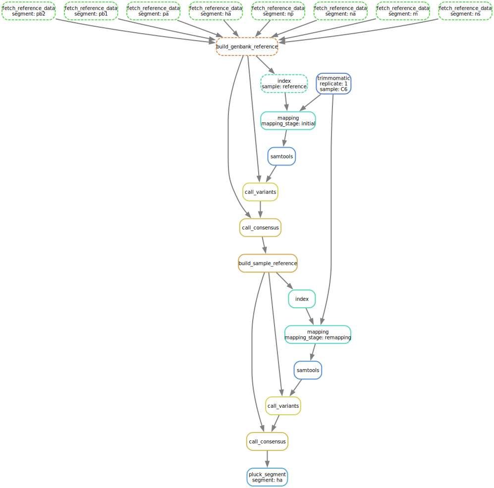
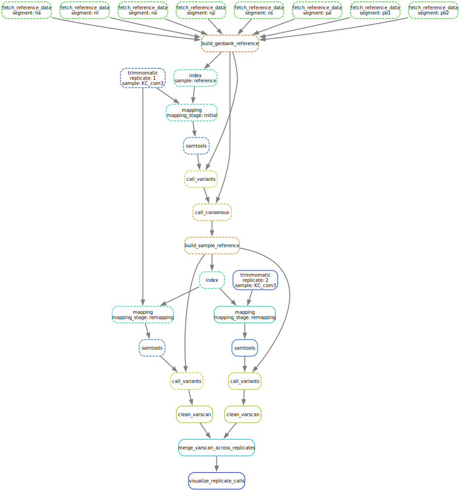

# Moncla Lab Illumina Pipeline Documentation

This document covers a more comprehensive overview of this pipeline.

## Table of Contents

1. **Starting from reads** - Going from data fresh off of Illumina sequences to infformation 
2. **Tools utilized** - Bioinformatics tools used in this pipeline with a brief description and rationale.
3. **User stories** - Various use cases for this pipeline and how to execute them.
4. **Output produced** - The various files that are produced by this pipeline.

## 1. Starting from reads

TODO: include PNGs captured from BaseSpace... go through workflow one more time and match it up. Like the one below:

## 2. Tools utilized

TODO: give a better description of the overall flow, but at this point it's [Snakemake](https://snakemake.readthedocs.io/en/stable/), [Bioconda](https://bioconda.github.io/), [Genbank records](https://www.ncbi.nlm.nih.gov/genbank/samplerecord/), [GTF format](https://genome.ucsc.edu/FAQ/FAQformat.html#format4), [Trimmomatic](https://academic.oup.com/bioinformatics/article/30/15/2114/2390096), [Bowtie2](https://www.nature.com/articles/nmeth.1923), [SAMtools](https://academic.oup.com/bioinformatics/article/25/16/2078/204688), [VarScan](https://genome.cshlp.org/content/22/3/568.short), [BEDTools](https://academic.oup.com/bioinformatics/article/26/6/841/244688),[SeqKit](https://journals.plos.org/plosone/article?id=10.1371/journal.pone.0163962), [MultiQC](https://academic.oup.com/bioinformatics/article/32/19/3047/2196507), [NCBI E-utilities](https://www.ncbi.nlm.nih.gov/books/NBK25501/), and [Bash](https://www.gnu.org/software/bash/).

## 3. User stories

TODO: write these up in more detail and confirm acceptability with Louise. Right now there's some functionality for individual samples:

as well as 

## 4. Output produced

TODO: write this up along with a description of each format